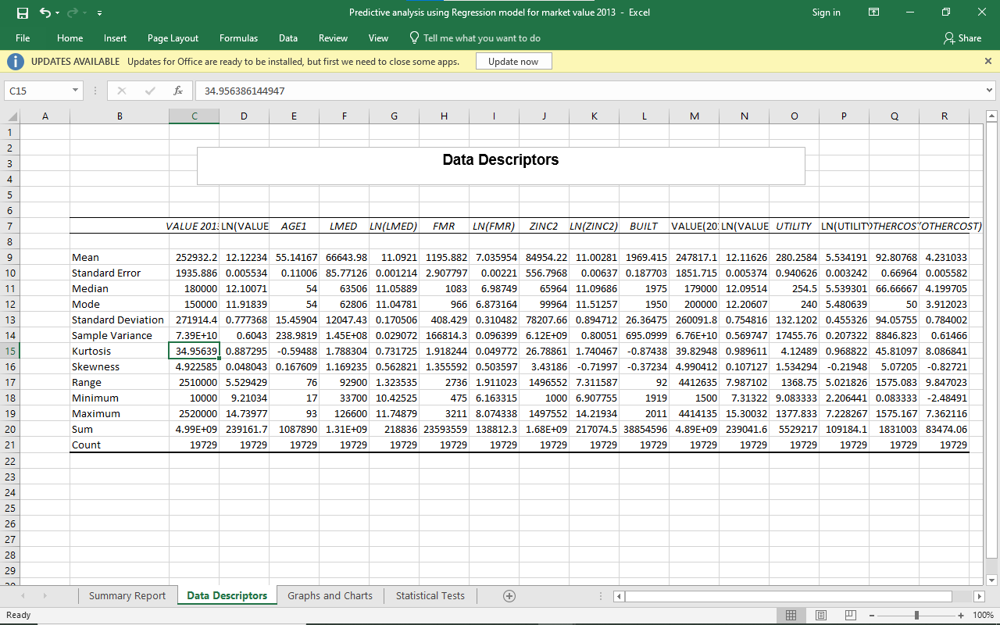

# Predictive model for market value of Housing units[HADS]

### Using Regression model and Holdout analysis 

## **INTRODUCTION**

This is a Business analysis project done entirely on Excel using the regression modelling technique to build a predictive model to determine the market value of ‘Single Family Housing Units’.  The Dataset which is the Housing and affordability Data system is gotten from the AHS national Data https://www.huduser.gov/portal/datasets/hads/hads.html

The purpose of this dataset is to provide analyst with consistent measures of affordability and cost burden over a long period. This Data is release about every two years, and it dates as far back as the 1990s. I downloaded the dataset for the following years 2003, 2005, 2007, 2011, 2013. 

**SKILLS/CONCEPT DEMONSTRATED**

VLOOKUP, Data cleaning, Pivot Table, Data analysis tool (Descriptive analysis, t-statistics, Regression model)

**PROBLEM STATEMENT**

To build a predictive model for the market value of ‘single family housing units’ for year 2013 using Regression model and Holdout Analysis

**DATA TRANSFORMATION AND CLEANING**

- Removed all housing units with market values less than $1000, also deleted missing and suspect data

- Removed all columns that were not relevant to the for the modelling operation

- For the predictive modelling instead of using the concurrent dependent and independent variables, I used the lag of the   independent variables I.e the dependent variable (market value of housing units) was from 2013 and the dependents variables were from 2011

- This was done by merging the two datasets (2013 and 2011) using the LOOKUP command using the control variable to match the datasets

- Calculated various descriptive statistics for the value variable and other independent variable using the descriptive analysis function in the data analysis toolkit in excel

**DATA MODELLING** 

- The distribution of the real Market value of Housing unit and the natural log value were visualized using histogram to determine which has a more normal distribution. This was also done for the independent variables 

- Categorical data such as Region, metropolitan status, housing Adequacy were put into consideration by assigning dummy variables 

**The PREDICTIVE model goes thus:**

MARKET VALUE (2013) = (β0 + β1 LN (MARKET VALUE) + β2 AGE1 + β3 METRO3 + β4 NORTHEAST + β5 MIDWEST + β6 SOUTH + β7 LN(LMED) + 
β8 LN(FMR) + β9 BEDRMS + β10 BUILT + β11 ROOMS + β12 PER + β13 LN(ZINC2) + β14 ZADEQ + β15 LN(UTILITY) + β16 LN(OTHERCOST)) (2011)

**DATA ANALYSIS**

- we make use of the natural log of the VALUE which is the dependent variable and also the natural log of some of the independent variables such as LMED, FMR, ZINC2, UTILITY AND OTHERCOST

- All p-values are below .05, which mean that they are statistically significant

- We held out 1000 housing units from the data and estimated the regression model on remaining data.

- The coefficients from the regression model are then used to predict the Market Value in the 'Hold-out Data'. 

- As a metric of prediction, we calculated the Mean Absolute Deviation (MAD) for our predictions

**RESULTS**

- The regression model has a R-square of 0.604 since we added the Market Value for year 2011 as an additional 'X' variable.

- Using the coefficients from this regression model and using the set of 'X' variables in the hold out data we make predictions of the Market Value for the 1000 housing units held out. The MAD statistic (Mean Absolute Deviation) for the prediction turns out to be $73,475.12. This seems ok given that the average Market Value is around $252,932.20

